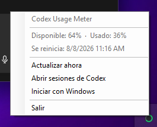
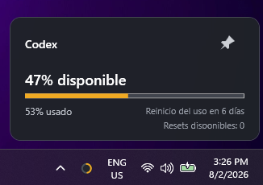
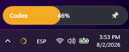
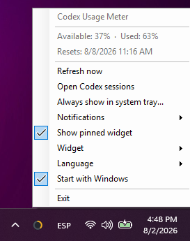

# Codex Usage Meter for Windows

[](https://github.com/aesgalexis/codex-usage-meter-windows/actions/workflows/ci.yml)
[](LICENSE)
[](https://github.com/aesgalexis/codex-usage-meter-windows)

A small, privacy-friendly Windows tray application that shows your latest Codex usage limit at a glance.



> [!IMPORTANT]
> This is an early development version. The app reads rate-limit snapshots written by Codex to local session files. That file format is not a documented public API and may change in future Codex versions.

Codex is not an installer dependency. If Codex is absent, the meter stays idle and reports that no usage data is available. It starts reading automatically after Codex creates a local session. If Codex is later removed, the meter returns safely to the same idle state. The Codex extension for Visual Studio Code is compatible because it writes the same local session data.

## Features

- Shows the available and used Codex percentages in the Windows notification area.
- Optionally shows a normal or compact usage card when you hover over or left-click the tray icon.
- Lets you pin that card as an always-visible desktop widget, drag it anywhere, and remember its position.
- Offers a compact pinned mode where the entire capsule is the available-usage bar with an integrated pin. Reset dots remain hidden until a reliable local reset-count source is available.
- Displays how many days remain until the usage limit resets.
- Shows the locally reported credit balance beneath the reset countdown without assuming that credits represent resets.
- Uses the same green, amber, or red status color in the tray icon and widget bar, based on the rounded available percentage.
- Reacts to Codex session changes almost immediately, with a 30-second fallback refresh.
- Offers persistent notifications for integer percentage changes, 50/75/90% usage thresholds, and limit resets.
- Opens the Windows setting used to keep its icon permanently visible.
- Uses a stable native notification-area identity so Windows can retain that visibility choice across upgrades.
- Optionally starts with Windows.
- Runs locally without account credentials, analytics, or telemetry from this app.
- Supports English and Spanish, selected during installation or changed later from the tray menu.

### Widget modes

The optional widget can use a detailed normal card or a minimal compact usage bar. Both designs can be shown temporarily or pinned and dragged anywhere on the desktop.

| Normal | Compact |
| --- | --- |
|  |  |

### Languages

The tray menu and usage displays support English and Spanish, with immediate switching from the language submenu.



## Installation

### Portable release

Download `CodexUsageMeter-Setup-win-x64.exe` from [Releases](https://github.com/aesgalexis/codex-usage-meter-windows/releases) and run it. The installer works per user, does not require administrator privileges, and keeps a stable location for future upgrades.

The portable `CodexUsageMeter-win-x64.zip` remains available for users who prefer not to install the app.

Published builds are self-contained: the destination PC does not need the .NET runtime installed.

### WinGet

The package is being prepared for the Windows Package Manager community catalog. Once Microsoft accepts the submission, installation and upgrades will use:

```powershell
winget install --id aesgalexis.CodexUsageMeter --exact
winget upgrade --id aesgalexis.CodexUsageMeter --exact
```

Interactive installer builds offer English and Spanish. Portable and silent WinGet installations use the Windows display language on first run. The language can always be changed later from the tray menu and is preserved across upgrades.

### Using the app

The app has no main window. After starting it, look for the circular indicator next to the Windows clock; it may initially appear under the hidden-icons arrow.

- **Default behavior:** no widget is shown; right-click opens the original tray menu and left-click shows the usage balloon.
- **Widget:** choose Disabled, Normal or Compact. The chosen design is used for both hover and pinned display.
- **Pin:** keep the card visible as a draggable desktop widget. Its position is restored next time.
- **Right-click:** pin or hide the widget, refresh, open the Codex sessions folder, enable startup with Windows, or exit.
- **Show always in the system tray:** opens the Windows taskbar setting directly, where you can promote Codex Usage Meter out of the hidden-icons menu.
- **Notifications:** enables or disables percentage changes, individual warning thresholds, and reset notices.

If the icon reports that no data is available, run at least one Codex task and select **Update now**.

## How it works

Codex writes session events below `%USERPROFILE%\.codex\sessions`. The app searches recent `.jsonl` session files, reads only their tail, and extracts the latest `rate_limits` snapshot. It does not read the files to reconstruct conversations.

```text
Codex local sessions
        ↓
CodexSessionUsageProvider
        ↓
UsageSnapshot
        ↓
Windows tray indicator
```

The provider compares event timestamps across recent sessions rather than trusting file modification order. It reads both `primary` and `secondary` rate-limit windows, identifies them by duration, and uses the most restrictive available window for the tray indicator while the normal widget lists every reported window. Temporary read failures retain the last valid value and mark it as stale.

The reader is isolated behind an `IUsageProvider` interface so it can be replaced if OpenAI publishes a suitable supported API.

## Privacy and security

- No OpenAI password, API key, or ChatGPT token is requested.
- Session contents and usage values never leave the computer.
- This project does not include its own analytics or telemetry.
- The optional start-with-Windows setting is stored in the current user's standard Windows `Run` registry key.
- Notification preferences are stored in `%LOCALAPPDATA%\CodexUsageMeter\settings.json`.

See [SECURITY.md](SECURITY.md) for vulnerability reporting.

## Requirements

For a published build:

- Windows 10 or Windows 11, x64.
- Codex or the Codex extension for Visual Studio Code, plus at least one recent task, is required only to display usage data.
- The app can be installed and started without Codex; it will wait for local session data.

For development:

- [.NET 8 SDK](https://dotnet.microsoft.com/download/dotnet/8.0).
- Git.

## Development

Clone and run:

```powershell
git clone https://github.com/aesgalexis/codex-usage-meter-windows.git
cd codex-usage-meter-windows
dotnet run --project .\src\CodexUsageMeter.App\CodexUsageMeter.App.csproj
```

Build and verify:

```powershell
dotnet build .\CodexUsageMeter.sln --configuration Release
dotnet run --project .\tests\CodexUsageMeter.Tests\CodexUsageMeter.Tests.csproj --configuration Release
```

Create a self-contained portable build:

```powershell
dotnet publish .\src\CodexUsageMeter.App\CodexUsageMeter.App.csproj `
  -p:PublishProfile=win-x64 `
  --output .\artifacts\win-x64
```

## Project structure

```text
src/
  CodexUsageMeter.App/             WPF application and tray integration
  CodexUsageMeter.Core/            Stable models and provider contract
  CodexUsageMeter.Infrastructure/  Local Codex session reader
tests/
  CodexUsageMeter.Tests/           Dependency-free parser/provider checks
```

## Roadmap

- English and Spanish localization following the [localization plan](docs/localization-plan.md).
- Optional corner snapping and widget appearance controls.
- Native Windows toast notifications and richer scheduling controls.
- Installer and automatic updates.
- ARM64 builds.
- Additional usage providers if a supported API becomes available.

Ideas and contributions are welcome. Read [CONTRIBUTING.md](CONTRIBUTING.md) before opening a pull request.

## Disclaimer

This is an independent open-source project and is not an official OpenAI product. Codex and OpenAI are trademarks of OpenAI.

## License

Distributed under the [MIT License](LICENSE).
